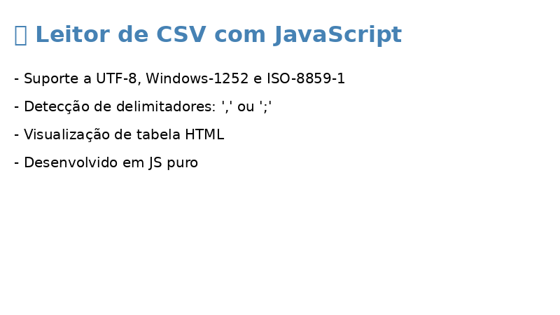

# Leitor de Arquivo CSV com JavaScript

Este projeto é uma aplicação web simples em HTML e JavaScript que permite ao usuário ler e visualizar arquivos CSV diretamente no navegador, com detecção de codificação e suporte a diferentes delimitadores. A interface é leve, funcional, sem depender de bibliotecas ou frameworks externos.

---

## 📌 Funcionalidades

- Leitura de arquivos `.csv` ou `.txt` diretamente no navegador.
- Seleçã de codificação de texto (`UTF-8`, `Windows-1252` ou `ISO-8859-1`).
- Detecção automática do delimitador do CSV (vírgula `,` ou ponto e vírgula `;`).
- Conversão de codificação para garantir a exibição correta de caracteres acentuados.
- Visualização dos dados em uma tabela HTML com cabeçalhos dinâmicos.
- Exibição de mensagens de erro claras em caso de problemas com o arquivo.

---

## 🧠 Como funciona

1. O usuário seleciona um arquivo `.csv` ou `.txt` e define a codificação (ou usa a detecção automática).
2. O JavaScript detecta o delimitador correto (`,` ou `;`).
3. O cabeçalho e os dados do CSV são lidos e convertidos para UTF-8 se necessário.
4. Os dados são exibidos em uma tabela HTML, com cabeçalho numerado e conteúdo organizado.
5. Em caso de erro de leitura, o usuário é alertado com uma mensagem clara.

---

## 📷 Captura de Tela

---

## 📦 Requisitos

- Navegador moderno com suporte a JavaScript e File API
- Nenhuma instalação de servidor é necessária

---

## 🎨 Tecnologias utilizadas

- HTML5
- JavaScript puro

---

## 📄 Licença

Este projeto é livre para uso educacional e pode ser modificado conforme necessário. Sem restrições.

---

## ✍️ Autor

🔗 GitHub: [github.com/rudineiw](https://github.com/rudineiw)
